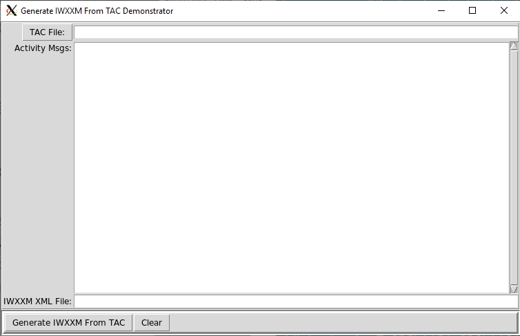

# Disclaimer
------------------------------------------------------------------------------
This repository is a scientific product and is not official communication of the National Oceanic and Atmospheric Administration (NOAA), or the United States Department of Commerce (DOC). All NOAA GitHub project code is provided on an ‘as is’ basis and the user assumes responsibility for its use. Any claims against the Department of Commerce or Department of Commerce bureaus stemming from the use of this GitHub project will be governed by all applicable federal law. Any reference to specific commercial products, processes, or services by service mark, trademark, manufacturer, or otherwise, does not constitute or imply their endorsement, recommendation, or favoring by the Department of Commerce. The Department of Commerce seal and logo, or the seal and logo of a DOC bureau, shall not be used in any manner to imply endorsement of any commercial product or activity by DOC or the United States Government.

------------------------------------------------------------------------------
# Continuous Integration Status

-------------------------------------------------------------------------------
# Generate IWXXM From TAC
This repository hosts software provided by the United States National Weather Service's [Meteorological Development Laboratory](https://vlab.ncep.noaa.gov/web/mdl) (MDL) that transforms Annex 3 Traditional Alphanumeric Code (TAC) forms into IWXXM v3.0 format.

The ICAO Meteorological Information Exchange Model (IWXXM) is a format for reporting weather information in eXtensible Markup Language (XML). The IWXXM XML schemas, developed and hosted by the WMO in association with ICAO, are used to encode aviation products described in the Meteorological Service for International Air Navigation, Annex 3 to the Convention on International Civil Aviation.

Version 3.0 of the IWXXM XML schemas encode METAR, SPECI, TAF, SIGMET, AIRMET, Volcanic Ash Advisory, Tropical Cyclone Advisory, and Space Weather Advisory reports.

This repository contains software, written exclusively in the Python language, that transforms the current TAC form of these reports into IWXXM XML documents. The advantage of the Python language is its popularity, rich functionality, and wide availability under many different computer operating systems.

## Introduction
IWXXM v3.0 will become a WMO standard on 5 November 2020. Met Watch Offices shall disseminate METAR, SPECI, TAF, AIRMET, SIGMET products and Tropical Cyclone, Volcanic Ash and Space Weather Advisories in IWXXM form on that date.

As XML, and creating XML documents, may be unfamiliar technology to those without an IT background, MDL is providing software to assist those in creating the new XML documents based on IWXXM v3.0 schemas.

## Prequisites
This software is written entirely in the Python language. Python interpreter version 2.7 or better is required.

## Installation
The following instructions assume you are using a computer with a Unix-based operating system. Installing this software on other operating systems may require some adjustments. These instructions install software that decodes the traditional alphanumeric code (TAC) forms of METAR, SPECI, TAF, Space Weather, Tropical Cyclone and Volcanic Ash advisories and encodes them into IWXXM equivalents.

To install the GIFTs1 package system-wide, use Python's setuptools package and issue the following commands:

	$ cd /path/to/install/directory
	$ git clone git@github.com:NOAA-MDL/GIFTs.git
	$ cd GIFTs
	$ python setup.py install

If you do not have sufficient  permissions to modify your Python's site-packages directory, then update your PATH or PYTHONPATH environmental variable to include the directories where the source code resides.

	$ setenv PATH ${PATH}:/path/to/install/directory/GIFTs/gifts:/path/to/install/directory/GIFTs/gifts/common # C-shell
	% export PATH=${PATH}:/path/to/install/directory/GIFTs/gifts:/path/to/install/directory/GIFTs/gifts/common # Bourne-shell
	
The python files' `import` statements will need to be modified too, if you should use this alternative.

## Configuration

### xmlConfig
While the METAR/SPECI and TAF encoders themselves require minimal setup for use, it is helpful to know how the resulting IWXXM documents can be tweeked. The file [xmlConfig.py](https://github.com/NOAA-MDL/GIFTs/blob/master/gifts/common/xmlConfig.py) has comments throughout describing the various XML configuration variables: what they're for, and what values they can take on should you want to make changes. The most likely change you will make is whether to provide the altitude of the aerodromes. The vertical datum must be known and provided in order to correctly describe the aerodromes' elevations.

### geoLocations database
The METAR/SPECI and TAF encoders will need an external/user-provided resource that maps the ICAO 4-character identifiers to the aerodromes' location. The `database/` subdirectory contains a simple python script to construct a python dictionary to perform the mapping. Please consult the [README](https://github.com/NOAA-MDL/GIFTs/tree/master/gifts/database) file in that directory for more details on how to create a simple database that the GIFT software can use. Either this technique or setting up a database client using one of Python's database modules is required in order to use the GIFT encoders. The latter technique is beyond the scope of these instructions.

## Using the software
To illustrate the use of the software, the demo subdirectory contains simple python programs, a small aerodrome database and sample files that we'll use to translate the TAC forms into IWXXM documents.  The demonstration program requires the Python Tk/Tcl package which is readily available with Python v3.8. 

    $ cd GIFTs/demo
    $ demo1.py

If the installation was successful, you should see a small GUI appear on your screen, the 'Generate IWXXM From TAC Demonstrator', like so,

The top row consists of a button, 'TAC File:' and a text field. Clicking on the 'TAC File' button pops up a secondary, file selection dialog, showing text files in the demo directory.  Select 'metars.txt' and click on 'Open'.

The "Activity Msgs:" is a label to the scrolled text window which will contain any error or cautionary messages during the decoding and encoding steps to create the IWXXM Meteorological Bulletin.  Pressing the 'Generate IWXXM From TAC' button produces the following output:

In the scrolled text window are messages from the METAR/SPECI TAC decoder which found some issues inside 'metars.txt'. The first message from the decoder:

    METAR LGAZ NIL
              ^
    Expecting issuance time ddHHmmZ

means at the point of the caret, '^', the decoder stopped because it was expecting to find the METAR issuance time, according to Annex 3 specifications for METAR/SPECI reports.  Consequently, the IWXXM METAR schema *requires* the issuance time as well in order to be valid. Because the time cannot be obtained from the TAC, and it is required information, an IWXXM XML document will not be created for this aerodrome.

The second observation with a decoding problem:

    METAR LGKL 110120Z 00000KT 9999 SCTO3O 18/16 Q1012
                                    ^
    Expecting directional minimum visibility or runway visual range or precipitation or obstruction to vision or precipitation in the vicinity or NCD, NSC or vertical visibility or cloud layer
 
The caret indicates that the decoder doesn't understand the scattered cloud layer at 3,000 ft. Do you see why? There are typos: a capital O were used in place of zeroes, 0.  For some fonts, the difference between the two characters are subtle. This illustrates that the decoder must understand everything in the TAC report in order to properly encode the data into XML. By fixing these typos, the IWXXM message for aerodrome LGKL can be created and the LGKL TAC can now be decoded cleanly by others as well.

The remaining METAR reports were decoded without issues and their data encoded into IWXXM and packaged up in an Meteorological Bulletin.

The Encoder class requires that the input file contain one WMO AHL line, appropriate for the TAC forms within it. Here are the regular expressions used to identify the WMO AHL line for particular TAC forms:

    S(A|P)[A-Z][A-Z]\d\d\s+[A-Z]{4}\s+\d{6}(\s+[ACR]{2}[A-Z])? # for METAR/SPECI
    FN\w\w\d\d\s+[A-Z]{4}\s+\d{6}(\s+[ACR]{2}[A-Z])? # Space Weather Advisories
    FK\w\w\d\d\s+[A-Z]{4}\s+\d{6}(\s+[ACR]{2}[A-Z])? # Tropical Cyclone Advisory
    FT\w\w\d\d\s+[A-Z]{4}\s+\d{6}(\s+[ACR]{2}[A-Z])? # TAF
    FV\w\w\d\d\s+[A-Z]{4}\s+\d{6}(\s+[ACR]{2}[A-Z])? # Volcanic Ash Advisory
And for capturing the individual TAC forms:

    ^(?:METAR|SPECI)\s+(?:COR\s+)?[A-Z][A-Z0-9]{3}\s.+?=
    ^SWX ADVISORY.+
    ^TC ADVISORY.+
    ^TAF(?:\s+(?:AMD|COR|CC[A-Z]|RTD))?\s+[A-Z]{4}.+?=
    ^VA ADVISORY.+
This means that for the METAR, SPECI and TAF, the product starts with one of those keywords and the product ends with a '=' character.  For the advisories, the software assumes there is just one advisory per input file.

The WMO AHL line in the TAC file is crucial in forming the proper filename for the IWXXM Meteorological Bulletin, which is shown in the 'IWXXM XML file" text field.  The format of the filename follows the specifications outlined for Aviation XML products in WMO No. 368 Manual on the Global Telecommunication System.

If you try to read the resulting XML file, you will see that it has no extraneous whitespace characters in it.  To make the XML file more readable, use the `xmllint --format` command to make the file contents "pretty".

## Caveats
The decoders were written to follow Annex 3 specifications for the TAC forms. If your observations or forecast products deviate significantly from Annex 3, then this software will likely refuse to encode the data into IWXXM.  Fortunately, solutions can be readily found, ranging from trivial to challenging (see United States METAR/SPECI [reports](https://nws.weather.gov/schemas/iwxxm-us/3.0/examples/metars)). If there is enough interest or requests about using this software, MDL can provide additional background information on how the software works and how it can be modified to meet your needs.

# IWXXM Validation
It is important that your IWXXM XML documents 'validate' before dissemination. If they don't, they may be rejected by your consumers. Separate from the GIFT software, MDL has provided a convienent python script that invokes NCAR's CRUX utility along with IWXXM schemas, schematron and supporting data files to perform this crucial step before disseminating your IWXXM products. The software can be found in the `/validation` subdirectory. Please consult the [README](https://github.com/NOAA-MDL/GIFTs/blob/master/validation) file for that utility.  You can use this utility to validate the IWXXM XML files created by the `demo1.py` program. 

-------------------
1Yes, we know the project name is presumptuous.
