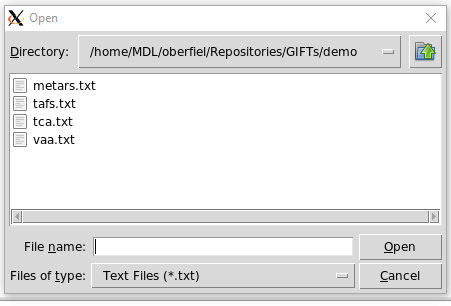
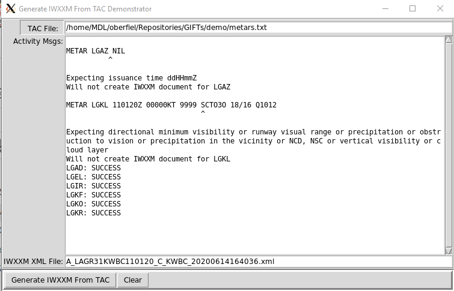

## Introduction

To illustrate the use of GIFTs, this subdirectory contains two simple python programs.

### demo1.py
demo1.py makes use of a small aerodrome database and sample files that we'll use to translate the TAC forms into IWXXM documents.  This demonstration program requires the Python Tk/Tcl package which is readily available with Python v3.9+. 

    $ cd GIFTs/demo
    $ demo1.py

If the GIFTs package installation was successful, you should see a small GUI appear on your screen, the 'Generate IWXXM From TAC Demonstrator', like so,

The top row consists of a button, 'TAC File:' and a text field. Clicking on the 'TAC File' button pops up a secondary, file selection dialog, showing text files in the demo directory.  Select 'metars.txt' and click on 'Open'.

The "Activity Msgs:" is a label to the scrolled text window which will contain any error or cautionary messages during the decoding and encoding steps to create the IWXXM Meteorological Bulletin.  Pressing the 'Generate IWXXM From TAC' button produces the following output:

In the scrolled text window are messages from the METAR/SPECI TAC decoder which found some issues inside 'metars.txt'. The first message from the decoder:

    METAR LGAZ NIL
              ^
    Expecting issuance time ddHHmmZ

means at the point of the caret, '^', the decoder stopped because it was expecting to find the METAR issuance time, according to Annex 3 specifications for METAR/SPECI reports.  Consequently, the IWXXM METAR schema *requires* the issuance time as well in order to be valid. Because the time cannot be obtained from the TAC, and it is required information, an IWXXM XML document will not be created for this aerodrome.

The second observation with a decoding problem:

    METAR LGKL 110120Z 00000KT 9999 SCT03O 18/16 Q1012
                                    ^
    Expecting directional minimum visibility or runway visual range or precipitation or obstruction to vision or precipitation in the vicinity or NCD, NSC or vertical visibility or cloud layer
 
The caret indicates that the decoder doesn't understand the scattered cloud layer at 3,000 ft. Do you see why? There are typos: a capital O was used in place of a zero, 0.  For some fonts, the difference between the two characters are subtle. This illustrates that the decoder must understand everything in the TAC report in order to properly encode the data into XML. By fixing these typos, the IWXXM message for aerodrome LGKL can be created and the LGKL TAC can now be decoded cleanly by others as well.

The remaining METAR reports were decoded without issues and their data encoded into IWXXM and packaged up in an Meteorological Bulletin.

The Encoder class requires that the input file contain one WMO AHL line, appropriate for the TAC forms within it. Here are the regular expressions used to identify the WMO AHL line for particular TAC forms:

    S(A|P)[A-Z][A-Z]\d\d\s+[A-Z]{4}\s+\d{6}(\s+[ACR]{2}[A-Z])? # for METAR/SPECI
    FK\w\w\d\d\s+[A-Z]{4}\s+\d{6}(\s+[ACR]{2}[A-Z])? # Tropical Cyclone Advisory
    F(C|T)\w\w\d\d\s+[A-Z]{4}\s+\d{6}(\s+[ACR]{2}[A-Z])? # TAF
    FV\w\w\d\d\s+[A-Z]{4}\s+\d{6}(\s+[ACR]{2}[A-Z])? # Volcanic Ash Advisory
And for capturing the individual TAC forms:

    ^(?:METAR|SPECI)\s+(?:COR\s+)?[A-Z][A-Z0-9]{3}\s.+?=
    ^TC ADVISORY.+
    ^TAF(?:\s+(?:AMD|COR|CC[A-Z]|RTD))?\s+[A-Z]{4}.+?=
    ^VA ADVISORY.+
This means that for the METAR, SPECI and TAF, the product starts with one of those keywords and the product ends with a '=' character.  For the advisories, the software assumes there is just one advisory per input file.

The WMO AHL line in the TAC file is critical in forming the proper filename for the IWXXM Meteorological Bulletin, which is shown in the 'IWXXM XML file" text field.  The format of the filename follows the specifications outlined for Aviation XML products in WMO No. 368 Manual on the Global Telecommunication System.

### iwxxmd.py
This program runs as a UNIX/Linux [daemon](https://en.wikipedia.org/wiki/Daemon_(computing)) that mostly sleeps as a background process, occasionally waking up when new, recently arrived TAC form messages arrive in a monitored filesystem directory. The daemon then translates the file's contents into the IWXXM form and write a new XML file to a separate directory. When no more TAC messages arrive, the daemon goes back to sleep to be awakened again when a new TAC message arrives.

`iwxxmd.py` does require Python's watchdog module to be installed like so,

    $ pip install watchdog

The associated configuration template file, `iwxxmd.cfg`, is well documented internally and should suffice in getting a IWXXM daemon up and running. Once the configuration file for a particular product is created, start the daemon. For instance,

    $ iwxxmd.py metar.cfg

By copying the template file with new names as needed, several IWXXM daemons can run simultaneously.

Any misconfiguration will result in an error message being written to the console and the daemon will not start. Like most UNIX/Linux daemons, the process can run indefinitely in the background. Should the daemon run into any difficulties, it will write messages to its log file.  The log file name format follows this format `<product>_iwxxmd_<DOW>` where `<product>` is one of `'metar'`, `'swa'`, `'taf'`, `'tca'`, or `'vaa'`, and `<DOW>` is the abbreviated day of the week, e.g. `'metar_iwxxmd_Mon'`. The daemon will 'ping' to the log file every hour to indicate that it is 'alive'. While active, the daemon will report the files read in and the files written out. When midnight arrives, the daemon will switch to a different log file. Thus, a maximum of seven log files are created with each file being overwritten after 6 days.
